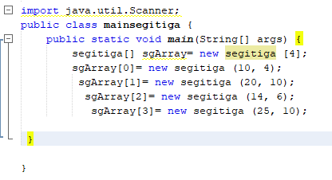

# LAPORAN PRAKTIKUM 3
## Praktikum  3.2.3. 
JAWABAN 
1. Iya, karena atribut dan method berkaitan.
2. Karena untuk setiap array of objek membutuhkan instan array of objeknya maka dilakukan pemanggilan
3. Kode itu adalah berarti instan of objeknya atau mendeklarasikan ada berapa banyak array seperti dicontoh
4. Menspesifikasikan isi dari objek atau mendeklarasikan nilai dari array tersebut.
5. Karena supaya konsep class yang dibuat jelass, agar tidak rancu dan bingung saat mencari main ataupun classnya.

## Praktikum 3.3.3 
JAWABAN
1. Bisa
2. contohnya 
public class Matriks {
public static void main(String[] args){
int[][] nilai = {{10,12},{11,14}};
for (int i = 0; i < nilai.length; i++) {
for (int j = 0; j < nilai[i].length; j++) {
System.out.print(nilai[i][j]+"\t");
}
System.out.println();
}
}
}

3. Kesalahan terletak pada coding tersebut kekurangan bagian instan objek yang seharusnya 
PgArray[5].persegi;
4.  

 
  
5. Tidak boleh, karena akan menimbulkan kerancuan.

## Praktikum 3.4.3 
JAWABAN 
 1. Boleh, karena konstruktor akan diproses jika ada pemanggialn
2. 

3. 

4. 

5. 

